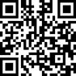
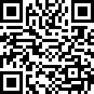
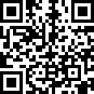

# Support This Project / Поддержать проект

[English](#english) | [Русский](#русский)

---

## English

### Why donate?

I build software and do research in AI, music generation, and neural networks. Most of what I create is free and open source — no API keys, no subscriptions, no paywalls.

Your donations allow me to keep creating and exploring without worrying about where the next meal comes from. Every contribution, no matter how small, helps me stay focused on building tools that anyone can use for free.

Thank you for making open source sustainable!

### Fiat (USD, EUR, RUB)

The easiest way to send dollars, euros, or rubles:

**[dalink.to/nerual_dreming](https://dalink.to/nerual_dreming)**

### Boosty (Patreon alternative)

Monthly support (Russian Patreon):

**[boosty.to/neuro_art](https://boosty.to/neuro_art)**

### Crypto

**BTC — Bitcoin**

`1E7dHL22RpyhJGVpcvKdbyZgksSYkYeEBC`

**ETH — Ethereum (ERC20)**

`0xb5db65adf478983186d4897ba92fe2c25c594a0c`

**USDT — Tether (TRC20)**

`TQST9Lp2TjK6FiVkn4fwfGUee7NmkxEE7C`

### Thank you!

Every star, share, and contribution matters. You're helping keep open-source AI tools alive and accessible to everyone.

---

## Русский

### Зачем донатить?

Я создаю софт и занимаюсь исследованиями в области ИИ, генерации музыки и нейросетей. Большая часть всего, что я делаю, находится в открытом доступе — без API-ключей, без подписок, без стен оплаты.

Ваши пожертвования позволяют мне создавать и исследовать больше, не отвлекаясь на поиск еды для продолжения существования =) Любой вклад, даже самый маленький, помогает мне оставаться сфокусированным на создании инструментов, которыми каждый может пользоваться бесплатно.

Спасибо, что делаете опенсорс возможным!

### Фиат (доллары, евро, рубли)

Самый простой способ отправить донат:

**[dalink.to/nerual_dreming](https://dalink.to/nerual_dreming)**

### Boosty (аналог Patreon)

Ежемесячная поддержка:

**[boosty.to/neuro_art](https://boosty.to/neuro_art)**

### Крипта

**BTC — Bitcoin**

`1E7dHL22RpyhJGVpcvKdbyZgksSYkYeEBC`

**ETH — Ethereum (ERC20)**

`0xb5db65adf478983186d4897ba92fe2c25c594a0c`

**USDT — Tether (TRC20)**

`TQST9Lp2TjK6FiVkn4fwfGUee7NmkxEE7C`

### Спасибо!

Каждая звезда, репост и донат имеют значение. Вы помогаете открытым AI-инструментам жить и оставаться доступными для всех.
