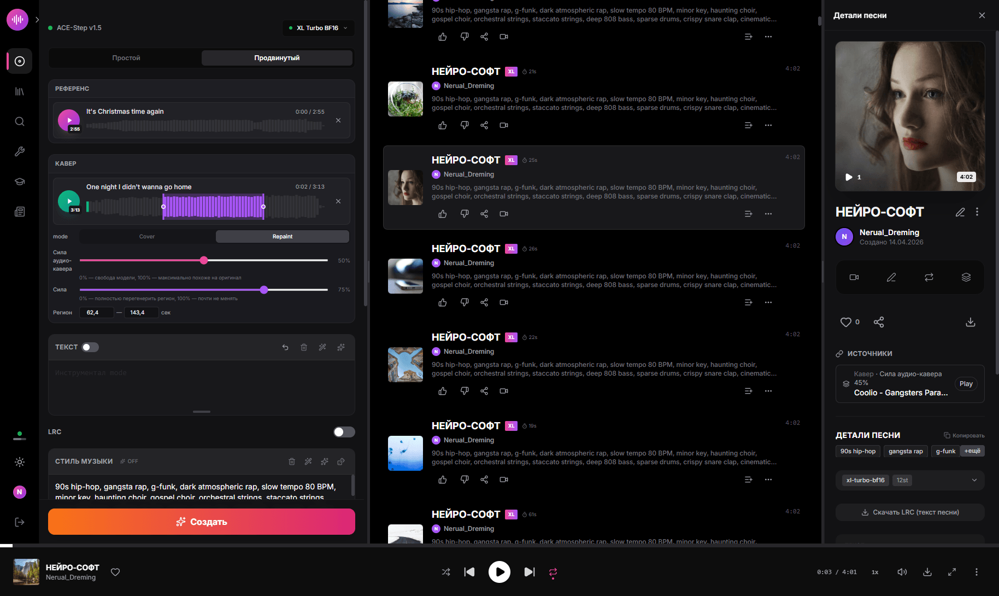
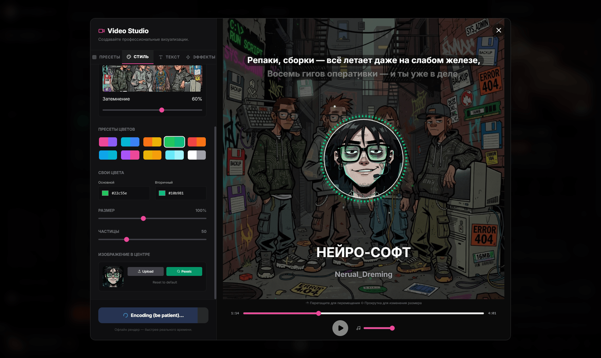

# ACE-Step Studio

<div align="center">

**Suno у вас дома. Локальная AI-студия для создания музыки — песни, вокал, тексты, каверы, клипы.**

[](https://github.com/timoncool/ACE-Step-Studio/stargazers)
[](LICENSE)
[](https://github.com/timoncool/ACE-Step-Studio/commits/master)

**[English version](README.md)**



</div>

Создавайте полноценные песни с вокалом, текстами, каверами, ремиксами и клипами — **100% локально**, без облака, без подписок, без интернета. Установка в один клик на Windows, работает на любой NVIDIA GPU с 12+ ГБ VRAM.

Построен на [ACE-Step 1.5 XL](https://github.com/ace-step/ACE-Step-1.5) — открытой модели генерации музыки на 4 миллиарда параметров (DiT).

## Почему ACE-Step Studio?

- **Бесплатно навсегда** — без API-ключей, кредитов и лимитов
- **Приватно** — ваша музыка никуда не отправляется
- **Портативно** — всё в одной папке, можно скопировать на флешку, удалил = деинсталлировал
- **Один клик** — `install.bat` → `run.bat` → создавай музыку

## Возможности

### Генерация музыки
- **Полноценные песни с вокалом** — до 8 минут, любой язык, любой жанр
- **Простой и Продвинутый режимы** — опишите что хотите или настройте каждый параметр
- **3 XL модели** — XL Turbo (8 шагов, быстро), XL SFT (50 шагов, максимальное качество), XL Turbo BF16 (компактная, 7.5 ГБ)
- **AI тексты и стиль** — LLM генерирует тексты и обогащает описание стиля
- **Горячая смена моделей** — меняйте DiT/LM модели без перезапуска
- **Пакетная генерация** — создание нескольких вариаций за раз
- **10 сэмплеров, 7 шедулеров** — euler, heun, midpoint, dopri5, deis, ipndm и другие
- **Поддержка LoRA** — загрузка LoRA весов при генерации
- **ID3 теги** — MP3 файлы включают название, исполнителя, обложку, текст, BPM
- **Whisper транскрипция** — автоматическая транскрипция загруженного аудио в LRC таймкоды

### Каверы и ремиксы
- **Режим Cover** — превращайте существующий трек в новый стиль, сохраняя мелодию
- **Режим Repaint** — перегенерируйте конкретные участки песни (выделение на волновой форме)
- **Референсное аудио** — используйте референс для направления стиля генерации
- **Контроль силы влияния** — баланс между исходным и сгенерированным звуком

### Видео Студия



- **Генератор клипов** — NCS-стиль визуализаторы с 10 пресетами
- **Караоке тексты** — синхронизированные LRC субтитры с 3 стилями (строки, бегущая строка, караоке-заливка)
- **WYSIWYG-редактор** — перетаскивание элементов, прокрутка для масштабирования
- **Соотношения сторон** — 16:9, 9:16 (Reels/TikTok), 1:1 (Instagram)
- **12 эффектов** — тряска, глитч, VHS, CCTV, сканлайны, свечение, зернистость, стробоскоп, виньетка, сдвиг цвета, леттербокс, пикселизация
- **Фон** — случайный, своё изображение, поиск по Pexels, видео-фон
- **Серверный рендеринг** — нативный ffmpeg с GPU-ускорением NVENC

### Аудио-инструменты
- **Аудио-редактор** — обрезка, фейды, эффекты (AudioMass)
- **Разделение дорожек** — разделение на вокал, ударные, бас, остальное (Demucs)
- **Скачивание LRC** — экспорт синхронизированных текстов

### Инструменты для моделей
- **BF16 конвертер** — конвертация safetensors из FP32/FP16 в BFloat16 (~50% уменьшение размера)
- **Мерджер моделей** — объединение двух ACE-Step моделей с настраиваемой альфой (3 метода)
- **Bake LoRA** — запекание весов LoRA в базовую модель

### Интерфейс
- **Один терминал** — один `run.bat`, Express управляет Python/Gradio автоматически
- **Портативность** — всё в одной папке, без системных установок
- **5 языков** — русский, английский, китайский, японский, корейский
- **Доступ по LAN** — используйте с любого устройства в сети (телефон, планшет)
- **Мониторинг GPU** — VRAM, RAM, CPU, температура в реальном времени
- **Тёмная/Светлая тема**

## Системные требования

| Компонент | Минимум | Рекомендуется |
|-----------|---------|---------------|
| GPU VRAM | 12 ГБ | 20+ ГБ |
| RAM | 16 ГБ | 32 ГБ |
| Диск | 30 ГБ | 60 ГБ (все модели) |
| ОС | Windows 10/11 | Windows 11 |
| GPU | RTX 3060+ | RTX 4090 |

## Быстрый старт

### 1. Клонировать

```bash
git clone https://github.com/timoncool/ACE-Step-Studio.git
cd ACE-Step-Studio
```

### 2. Установить

```
install.bat
```

Выберите тип GPU (CUDA 12.8 / 12.6 / 12.4). Установит портативный Python 3.12, PyTorch, Node.js 22 и все зависимости — ничего системного.

### 3. Запустить

```
run.bat
```

Браузер откроется автоматически на http://localhost:3001. Модели скачиваются при первом запуске (~7.5 ГБ для BF16 модели по умолчанию).

## Батники запуска

| Скрипт | Описание |
|--------|----------|
| `run.bat` | Стандартный запуск — DiT + LM (0.6B PT), все функции |
| `run-no-lm.bat` | Запуск без LM — больше VRAM для DiT, каверы/рисование работают, нет AI-текстов |
| `run-dev.bat` | Режим разработки — 3 терминала с Vite HMR |
| `install.bat` | Установщик в один клик |
| `update.bat` | Обновление кода + зависимостей + пересборка фронтенда |
| `reinstall.bat` | Чистая переустановка (сохраняет модели и данные) |
| `download_model.bat` | Предварительная загрузка моделей |

## Модели

| Модель | Размер | Шагов | Скорость | Качество |
|--------|--------|-------|----------|----------|
| XL Turbo BF16 | 7.5 ГБ | 8 | Быстро | Высокое |
| XL Turbo | 18.8 ГБ | 8 | Быстро | Очень высокое |
| XL SFT | 18.8 ГБ | 50 | Медленно | Максимальное |
| XL Merge SFT+Turbo | 18.8 ГБ | 12 | Средне | Очень высокое |

### LM модели (AI для текстов/стиля)

| Модель | VRAM | Качество |
|--------|------|----------|
| 0.6B | ~0.5 ГБ | Базовое |
| 1.7B | ~1.5 ГБ | Хорошее |
| 4B | ~4 ГБ | Лучшее |

Бэкенд LM: **PT** (PyTorch, легче) или **vLLM** (быстрее инференс, больше VRAM).

## Обновление

```
update.bat
```

Подтягивает последний код, обновляет зависимости Python/Node, пересобирает фронтенд.

## Участие в разработке

Будем рады вашему вкладу! Как помочь:

- **Сообщить о баге** — [создайте issue](https://github.com/timoncool/ACE-Step-Studio/issues)
- **Предложить фичу** — [создайте issue](https://github.com/timoncool/ACE-Step-Studio/issues)
- **Отправить PR** — смотрите [AGENTS.md](AGENTS.md) для архитектуры и правил

Области, где особенно нужна помощь:
- Поддержка macOS / Linux
- Новые пресеты визуализатора для Видео Студии
- Переводы (i18n)
- Улучшения UI обучения LoRA
- Документация и туториалы

## Другие портативные нейросети

| Проект | Описание |
|--------|----------|
| [Foundation Music Lab](https://github.com/timoncool/Foundation-Music-Lab) | Генерация музыки + редактор таймлайна |
| [VibeVoice ASR](https://github.com/timoncool/VibeVoice_ASR_portable_ru) | Распознавание речи |
| [LavaSR](https://github.com/timoncool/LavaSR_portable_ru) | Улучшение качества звука |
| [Qwen3-TTS](https://github.com/timoncool/Qwen3-TTS_portable_rus) | Озвучка текста от Qwen |
| [SuperCaption Qwen3-VL](https://github.com/timoncool/SuperCaption_Qwen3-VL) | Описание изображений |
| [VideoSOS](https://github.com/timoncool/videosos) | AI видеопроизводство |
| [RC Stable Audio Tools](https://github.com/timoncool/RC-stable-audio-tools-portable) | Генерация музыки и звуков |

## Авторы

- **Nerual Dreming** — [Telegram](https://t.me/nerual_dreming) | [neuro-cartel.com](https://neuro-cartel.com) | [ArtGeneration.me](https://artgeneration.me)
- **Neiro-Soft** — [Telegram](https://t.me/neuroport) | портативные нейросети

## Благодарности

- **[ACE-Step Team](https://github.com/ace-step)** — открытая модель ACE-Step 1.5
- **[fspecii](https://github.com/fspecii/ace-step-ui)** — оригинальный ACE-Step UI
- [AudioMass](https://audiomass.co/) — браузерный аудио-редактор
- [Demucs](https://github.com/facebookresearch/demucs) — разделение дорожек от Meta
- [Pexels](https://www.pexels.com/) — бесплатные фото/видео
- [Gradio](https://gradio.app/) — ML-фреймворк
- [FFmpeg](https://ffmpeg.org/) — видео-кодирование

---

<div align="center">

**Нравится проект? Поставьте звезду!**

[](https://star-history.com/#timoncool/ACE-Step-Studio&Date)

</div>
